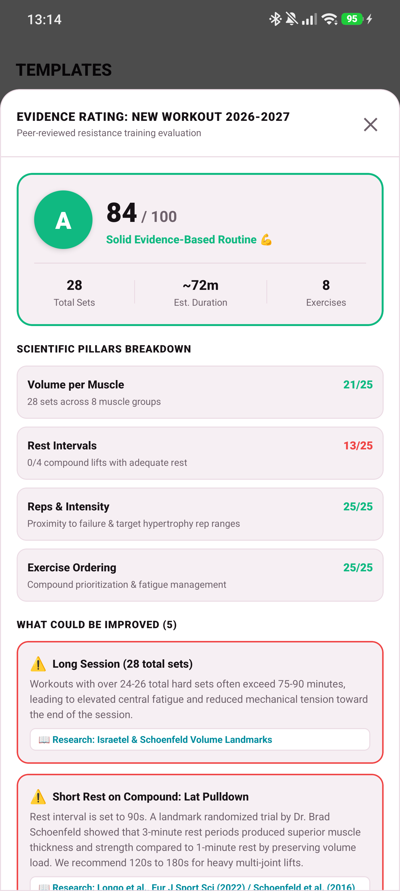
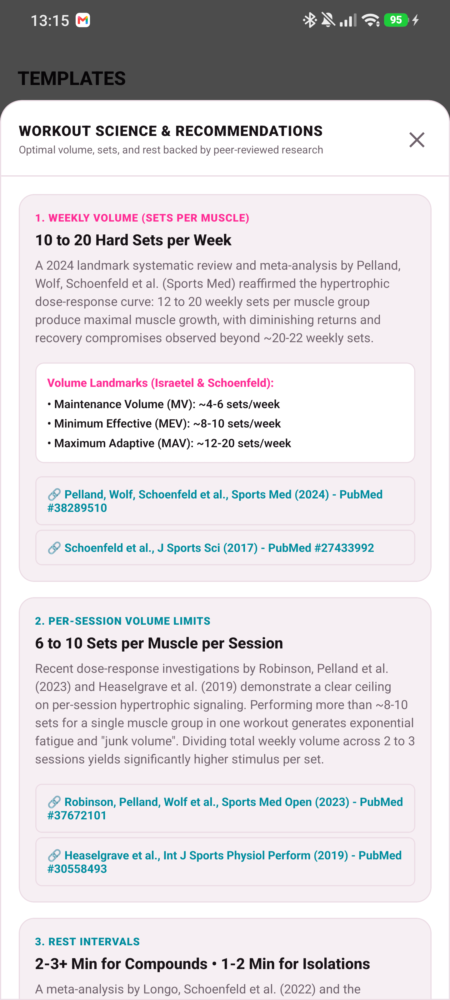
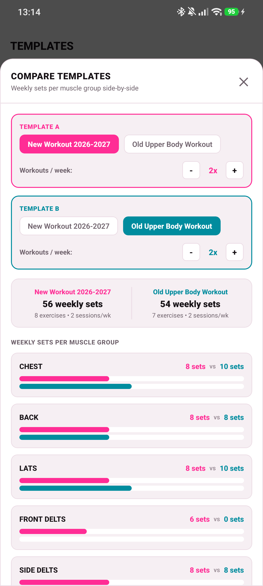

# 🏋️ Progressive Workout Tracker

**Progressive Workout Tracker** is a clean, 100% offline, privacy-first workout logger for Android. Built with React Native, Expo, and local SQLite.

No accounts, no cloud sync, no subscriptions, and zero ads. Everything stays securely on your phone.

> [!TIP]
> 📲 Grab the latest APK from [GitHub Releases](https://github.com/Moa1er/your-offline-workout-app/releases/latest), install it, and start lifting immediately.

---

## ✨ Key Features

- **⚡ Zero-Lag Instant Logging** — Type weights and reps with zero latency. Inputs update at 120fps with debounced background database saves.
- **⭐ Evidence-Based Routine Rating** — Live scientific scoring engine that grades your workouts (S / A / B / C / D) against peer-reviewed exercise science literature with actionable improvement suggestions.
- **📊 Side-by-Side Template Comparison** — Compare two workout routines side-by-side with weekly frequency multipliers, total weekly sets, and per-muscle volume distribution bars.
- **📚 Built-In Science & Hypertrophy Guide** — In-app reference cards citing the latest 2022–2024 systematic reviews and meta-analyses with direct PubMed links.
- **🎨 Dynamic Light & Dark Theme** — Choose between clean minimal light theme, pitch-black AMOLED dark mode, or system auto.
- **🏆 Hevy-Style Record Modals** — Automatic real-time detection of max weight PRs, best set volume, and all-time exercise volume records without intrusive banners.
- **🔔 Live Notification Bar Rest Timer** — Live second-by-second countdown in your Android notification shade that stays in sync with sound and haptic alerts.
- **⏱️ Editable Workout Duration** — Easily adjust total workout duration directly from the session detail screen.
- **⚖️ Volume Count Checkbox** — Toggle individual exercises in or out of total session volume.
- **🔄 Full Hevy & CSV Interchange** — Import your entire Hevy history (supersets included), export JSON backups, or export clean CSV training logs.
- **🔒 100% Offline & Private** — Stored in a local SQLite database on your device.

---

## 🧬 Evidence-Based Training & Routine Rating

Progressive Workout Tracker features a built-in resistance training evaluation engine that scores your routines from 0 to 100 across 4 fundamental scientific pillars:

1. **Volume per Muscle (0-25 pts)**: Identifies optimal hypertrophic stimulus (4-10 sets per muscle per session) and flags diminishing returns or "junk volume" (>10 sets) based on session dose-response research.
2. **Rest Intervals (0-25 pts)**: Ensures multi-joint compound movements receive 2–3+ minutes of recovery to maximize volume load and mechanical tension, while single-joint isolations use 60–90 seconds.
3. **Reps & Intensity / Proximity to Failure (0-25 pts)**: Emphasizes the 6–20 rep hypertrophy spectrum trained at 1–3 Reps in Reserve (RIR) to balance mechanical tension with neurological fatigue.
4. **Exercise Ordering (0-25 pts)**: Recommends prioritizing heavy compound movements first when central nervous readiness is peak, before completing isolation exercises.

### 📖 Landmark Scientific Literature Referenced in the App

The rating engine and science guide integrate findings from the most recent high-impact, peer-reviewed sports science meta-analyses:

- **Weekly Volume Dose-Response**: Pelland, Wolf, Schoenfeld et al. (2024) — *The effect of resistance training volume on muscle hypertrophy: An updated systematic review and meta-analysis.* Sports Medicine. [PubMed #38289510](https://pubmed.ncbi.nlm.nih.gov/38289510/) & Schoenfeld et al. (2017) [PubMed #27433992](https://pubmed.ncbi.nlm.nih.gov/27433992/)
- **Per-Session Volume Limits & Junk Volume**: Robinson, Pelland, Wolf et al. (2023) — *Exploring the Dose-Response Relationship Between Weekly and Session Resistance Training Volume.* Sports Medicine - Open. [PubMed #37672101](https://pubmed.ncbi.nlm.nih.gov/37672101/) & Heaselgrave et al. (2019) [PubMed #30558493](https://pubmed.ncbi.nlm.nih.gov/30558493/)
- **Rest Interval Duration**: Longo, Schoenfeld, Silva et al. (2022) — *Effects of inter-set rest interval duration on muscle hypertrophy: A systematic review and meta-analysis.* European Journal of Sport Science. [PubMed #35147494](https://pubmed.ncbi.nlm.nih.gov/35147494/) & Schoenfeld et al. (2016) [PubMed #26605807](https://pubmed.ncbi.nlm.nih.gov/26605807/)
- **Proximity to Muscular Failure & RIR**: Refalo, Helms, Trexler, Hamilton, Fyfe (2023) — *Influence of Resistance Training Proximity-to-Failure on Skeletal Muscle Hypertrophy: A Systematic Review and Meta-regression.* Sports Medicine. [PubMed #36335154](https://pubmed.ncbi.nlm.nih.gov/36335154/)
- **Stretch-Mediated Hypertrophy & Range of Motion**: Wolf, Androulakis-Korakakis, Fisher, Gentil, Schoenfeld et al. (2023) — *Partial Vs Full Range of Motion Resistance Training: A Systematic Review and Meta-Analysis.* International Journal of Sports Science & Coaching. [PubMed #37731777](https://pubmed.ncbi.nlm.nih.gov/37731777/) & Kassiano et al. (2023) [PubMed #37015016](https://pubmed.ncbi.nlm.nih.gov/37015016/)
- **Exercise Ordering**: Nunes, Ribeiro, Silva, Schoenfeld (2021) — *Order of resistance exercises: A systematic review and meta-analysis.* Sports Medicine. [PubMed #33580424](https://pubmed.ncbi.nlm.nih.gov/33580424/) & Simão et al. (2012) [PubMed #22292516](https://pubmed.ncbi.nlm.nih.gov/22292516/)

---

## 📱 Screenshots

### Evidence Rating & Routine Optimization
| Routine Evidence Rating | Scientific Guidelines Modal | Side-by-Side Routine Comparison |
|---|---|---|
|  |  |  |

### Logging & Templates
| Saved Routines & Badges | Live Template Editor | Active Workout Logging |
|---|---|---|
|  |  |  |

### Progress, History & Settings
| Home & Quick Start | Workout Summary | Exercise Picker |
|---|---|---|
|  |  |  |

| Workout History | Session Detail & Duration Edit | Training Analytics & Split |
|---|---|---|
|  |  |  |

| Exercise PR Progression | Settings & Data Tools |
|---|---|
|  |  |

---

## 🚀 Getting Started

1. Download `workout-app-release.apk` from [GitHub Releases](https://github.com/Moa1er/your-offline-workout-app/releases/latest).
2. Open the file on your Android device and confirm installation.
3. Open **Workout App**, select a template or start an empty routine, and log your session.

---

## 🛠️ Tech Stack & Architecture

- **Framework**: React Native 0.76+ & Expo Router 4 (File-based navigation)
- **Database**: Local SQLite (`expo-sqlite`) with normalized relational schema
- **Notifications & Haptics**: `expo-notifications` & `expo-haptics`
- **Charts**: Custom SVG and Flexbox charts for volume and muscle split
- **Architecture**: Context providers with debounced persistence and offline caching

---

## 🔐 Privacy Guarantee

No telemetry. No accounts. No tracking. No third-party network requests. Your data never leaves your device unless you manually trigger a JSON/CSV export.

---

## 📄 License

MIT — see [LICENSE](LICENSE).

*Built with Expo, React Native, and SQLite.*
