# 🏋️ Progressive Workout Tracker

**Progressive Workout Tracker** is a clean, 100% offline, privacy-first workout logger for Android. Built with React Native, Expo, and local SQLite.

No accounts, no cloud sync, no subscriptions, and zero ads. Everything stays securely on your phone.

> [!TIP]
> 📲 Grab the latest APK from [GitHub Releases](https://github.com/Moa1er/your-offline-workout-app/releases/latest), install it, and start lifting immediately.

---

## ✨ Key Features

- **⚡ Zero-Lag Instant Logging** — Type weights and reps with zero latency. Inputs update at 120fps with debounced background database saves.
- **🎨 Dynamic Light & Dark Theme** — Choose between clean minimal light theme, pitch-black AMOLED dark mode, or system auto.
- **🏆 Hevy-Style Record Modals** — Automatic real-time detection of max weight PRs, best set volume, and all-time exercise volume records.
- **🔔 Live Notification Bar Rest Timer** — Live second-by-second countdown in your Android notification shade that stays in sync with sound and haptic alerts.
- **⏱️ Editable Workout Duration** — Easily adjust total workout duration directly from the session detail screen.
- **📊 Template Comparison & Weekly Volume** — Compare two workout routines side-by-side with weekly workout frequency and muscle group set breakdowns.
- **📚 Evidence-Based Hypertrophy Guidelines** — In-app training guide backed by peer-reviewed sports science research (Schoenfeld, Refalo, Helms).
- **⚖️ Volume Count Checkbox** — Toggle individual exercises in or out of total session volume.
- **🔄 Full Hevy & CSV Interchange** — Import your entire Hevy history (supersets included), export JSON backups, or export clean CSV training logs.
- **🔒 100% Offline & Private** — Stored in a local SQLite database on your device.

---

## 📱 Screenshots

| Home & Routines | Active Workout Logging | Live Rest Timer |
|---|---|---|
| 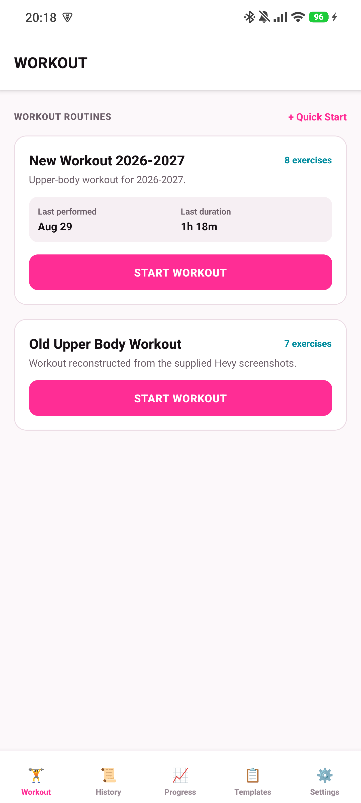 | 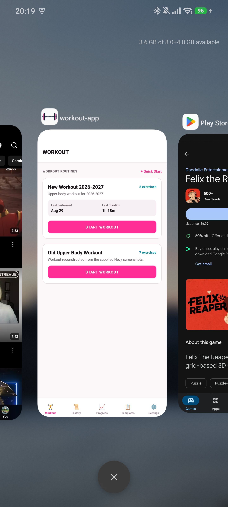 | 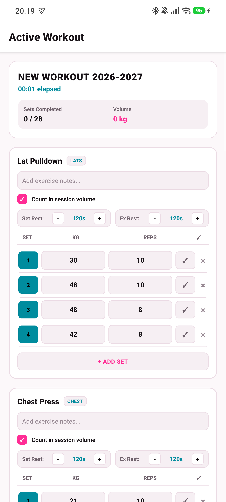 |

| Templates & Comparison | Template Editor | Exercise Picker |
|---|---|---|
| 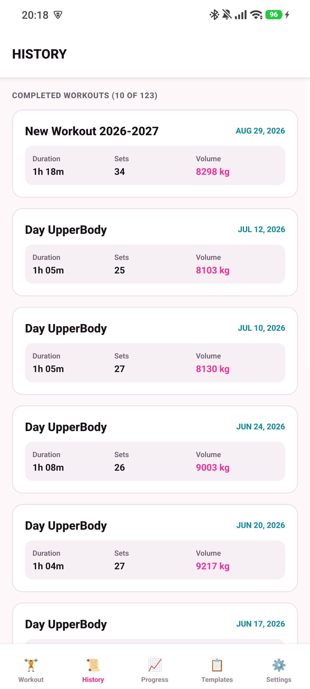 | 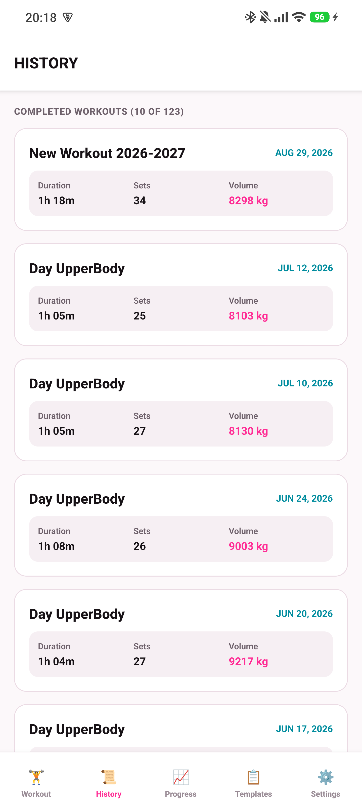 | 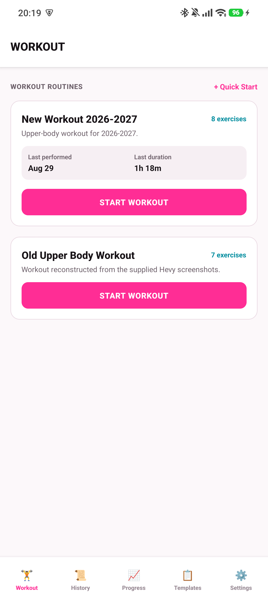 |

| Session Detail | History & Duration Editing | Workout Summary |
|---|---|---|
| 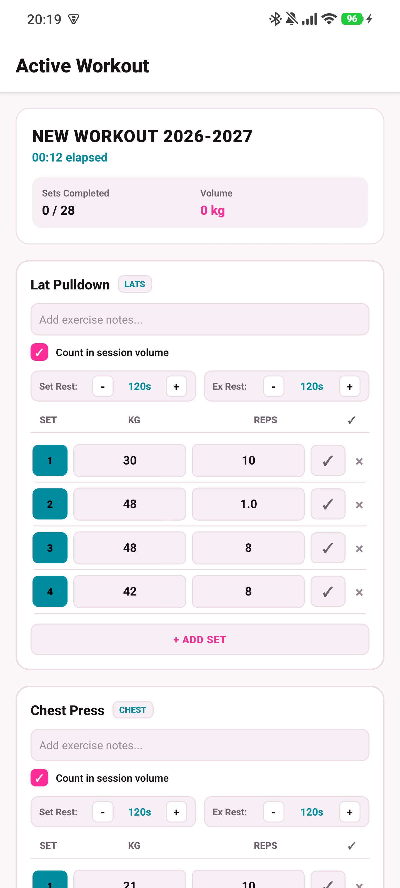 | 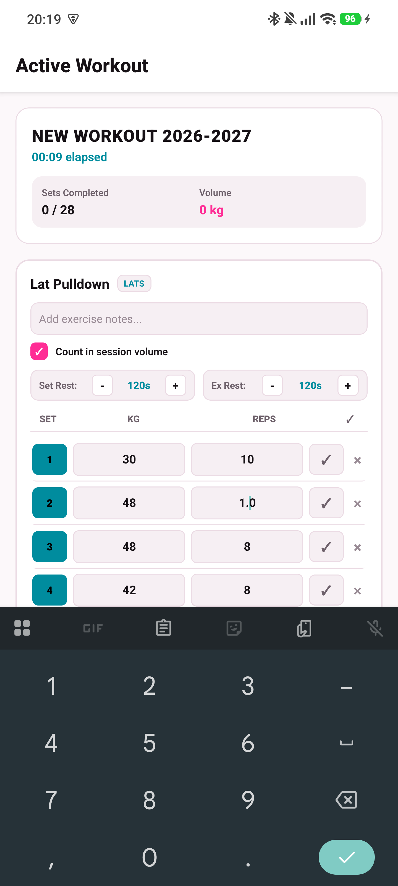 | 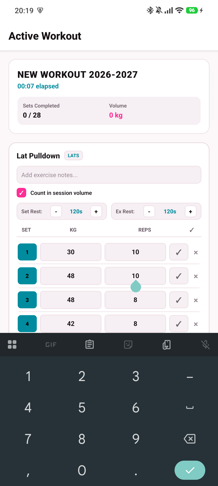 |

| Progress Dashboard | Volume & Split Charts | Settings & Backup Tools |
|---|---|---|
| 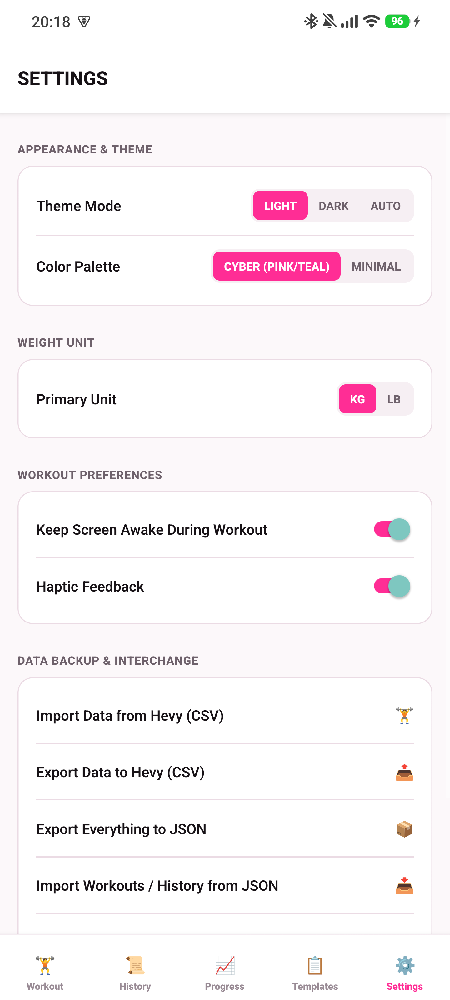 | 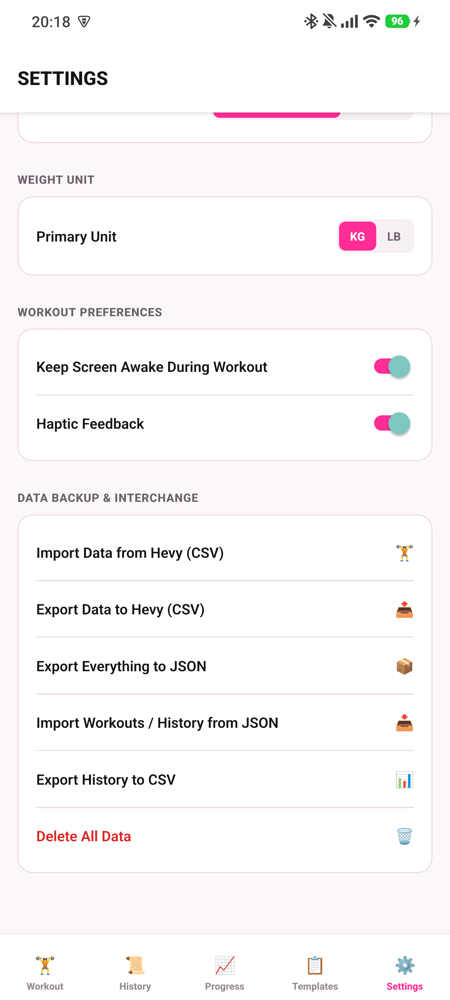 | 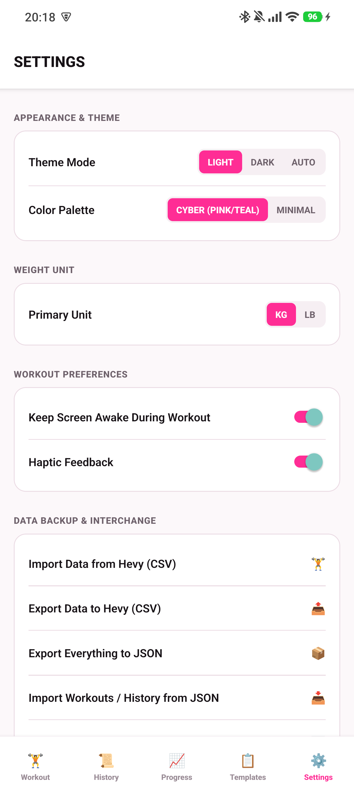 |

---

## 🚀 Getting Started

1. Download `app-release.apk` from [GitHub Releases](https://github.com/Moa1er/your-offline-workout-app/releases/latest).
2. Open the file on your Android device and confirm installation.
3. Open **Workout App**, select a template or start an empty routine, and log your session.

---

## 🛠️ Tech Stack & Architecture

- **Framework**: React Native 0.76+ & Expo Router 4 (File-based navigation)
- **Database**: Local SQLite (`expo-sqlite`) with normalized relational schema
- **Notifications & Haptics**: `expo-notifications` & `expo-haptics`
- **Charts**: Custom SVG and Flexbox charts for volume and muscle split
- **Architecture**: Context providers with debounced persistence and offline caching

---

## 🔐 Privacy Guarantee

No telemetry. No accounts. No tracking. No third-party network requests. Your data never leaves your device unless you manually trigger a JSON/CSV export.

---

## 📄 License

MIT — see [LICENSE](LICENSE).

*Built with Expo, React Native, and SQLite.*
