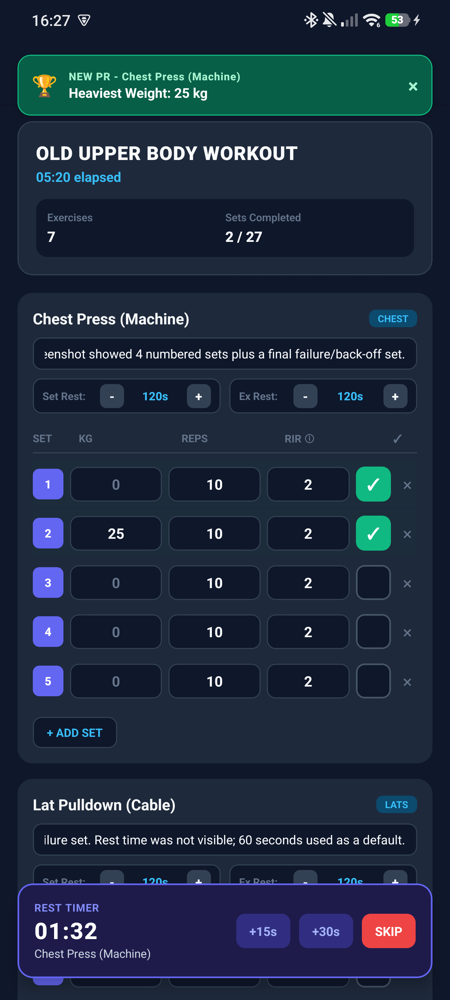

# 🏋️ Progressive Workout Tracker

**Progressive Workout Tracker** is a fully offline workout logger for Android. Plan your routines, log every set with weight, reps, and RIR, and let the app track your personal records, volume, and progress.

I built it because every workout app I tried wanted an account, a subscription, or cloud sync for something that should just live on my phone.

> [!TIP]
> 📲 Want to try it? Grab the latest APK from [GitHub Releases](https://github.com/Moa1er/your-offline-workout-app/releases/latest), install it, and start your first routine.

---

## Why I built it

I like things that work without me having to think about them. A workout tracker should be: open the app, tap a few times, lift. That's it.

- **Logging takes seconds.** Previous lifts are pre-filled, rest timers start automatically, and you spend your time training instead of typing.
- **PRs are automatic.** Heaviest weight, most reps at a weight, and best estimated 1RM are detected the moment you finish a set.
- **Progress you can see.** Volume over time, muscle-by-muscle split, and per-exercise charts.
- **Rest timers that help, not nag.** Auto-start between sets, +15s/+30s when you need more time, and a notification when it's time to lift again.
- **Routines you can reuse.** Build templates with target sets, rep ranges, RIR, and rest times, then start one with a tap.
- **Hevy-compatible.** Import your entire Hevy history (supersets included) or export back. Switch whenever you want.
- **Offline and private.** Everything lives in a local SQLite database on your device. No account, no ads, no trackers.

---

## 📱 Take a look

| Logging a workout | Rest timer running | PR celebration |
|---|---|---|
|  |  |  |

| Home & routines | Workout complete | History |
|---|---|---|
|  |  |  |

| Progress overview | Charts & records | Session detail |
|---|---|---|
|  |  |  |

| Templates | Template editor | Exercise picker |
|---|---|---|
|  |  |  |

| Settings & data tools |
|---|
|  |

---

## 🚀 Getting started

1. Download the APK from [GitHub Releases](https://github.com/Moa1er/your-offline-workout-app/releases/latest).
2. Open the file and allow installation when your phone asks.
3. Open **Progressive Workout Tracker**, pick a routine, and go lift.

New to the app? On first launch you can install the built-in **Full Upper Body** routine, or import years of Hevy history from a CSV export via **Settings → Import Data from Hevy (CSV)**.

---

## 🛠️ Features in detail

- **Active workout screen** — set-by-set tables with weight (kg/lb), reps, RIR, set type cycling (Working / Warm-up / Failure / Drop set), exercise notes, and per-exercise rest overrides.
- **Workout recovery** — close the app mid-workout and pick up right where you left off, even after a reboot.
- **Rest timer** — auto-starts after every set (or exercise), with haptics, sound, a floating +15s/+30s/SKIP overlay, and a local notification.
- **Personal records** — three PR types per exercise, recalculated after every finished session, with celebration toasts when you earn one.
- **Progress dashboard** — training overview, total volume over time, muscle volume split, per-exercise charts (best weight / estimated 1RM / volume), and a PR timeline.
- **History** — paginated session history with duration, working sets, volume, and full set-level detail.
- **Templates** — create, edit, duplicate, and delete routines with target sets, rep ranges, RIR, and rest times.
- **Data ownership** — export everything as a versioned JSON backup, export CSV history, and import/export Hevy CSV.

---

## 🔐 Privacy

No account. No ads. No trackers. No network permission required. Your training data lives in a local SQLite database on your phone, and the only files that ever leave your device are the backups *you* choose to export.

---

## 🧑‍💻 For developers

Architecture, data model, build instructions, and testing live in **[TECHNICAL.md](TECHNICAL.md)**.

---

## 📄 License

MIT — see [LICENSE](LICENSE).

*Made with Expo, React Native, and SQLite.*
